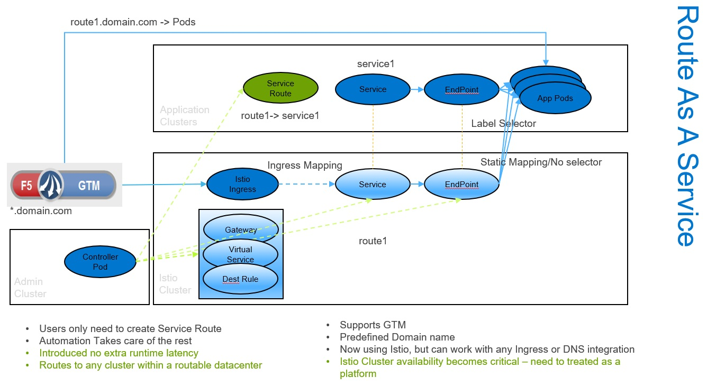

# serviceroute-controller

This controller controls the lifecyle of a CRD called ServiceRoute. In the example below, for a service called **grafana** in the namespace **grafana-blendstat**, the ServiceRoute declares a route called **grafana-route**.
```yaml
apiVersion: networking.dcb/v1alpha1
kind: ServiceRoute
metadata:
  name: grafana
  namespace: grafana-blendstat
spec:
  routeName: grafana-route
```
The controller acts as the route provider. It monitors the CRD and creates the route using potentially any ingress setup or DNS automation, but in the current implementation, it creates routes on a separate Istio cluster using Virtual Service, Destination Rules, and Ingress Gateway. Upon completion, the controller will update the status with FQDN.
```yaml
apiVersion: networking.dcb/v1alpha1
kind: ServiceRoute
metadata:
  name: grafana
  namespace: grafana-blendstat
spec:
  routeName: grafana-route
status:
  fullRouteName: grafana-route.domain.com
```
In essense, it allows an istio cluster to provide **route as a service**, a service needed when manual setup of wildcard dns and certificate takes time.


## Architecture
<p align="center">
  
</p>

**Note:** The copying of services from the application cluster to the istio-cluster is compatible with the [Multi-Cluster Services API proposal](https://github.com/kubernetes/enhancements/issues/1645)

## Details

This controller uses [sample controller](https://github.com/kubernetes/sample-controller) extensively.

## Build

### When using go 1.11 modules
When using go 1.11 modules (`GO111MODULE=on`), issue the following
commands --- starting in whatever working directory you like.

```sh
git clone https://github.com/ibmdcb/k8s-serviceroute-conrtoller.git
cd k8s-serviceroute-conrtoller
go build -o serviceroute-controller .
```
### Docker
```sh
docker build -t k8s-serviceroute-conrtoller:latest .
```
## Deploy

### On Istio Cluster

* Install Istio 
* Configure Secure Ingress Gateway. The following example references [istio example](https://archive.istio.io/v1.4/docs/tasks/traffic-management/ingress/secure-ingress-mount/). Newer versions of Istio should work similarly, will test soon.
```yaml
apiVersion: v1
items:
- apiVersion: networking.istio.io/v1alpha3
  kind: Gateway
  metadata:
    name: httpbin-gateway
    namespace: sample
  spec:
    selector:
      istio: ingressgateway
    servers:
    - hosts:
      - abc.domain.com
      port:
        name: http-redirect
        number: 80
        protocol: HTTP
      tls:
        httpsRedirect: true
    - hosts:
      - abc.domain.com
      port:
        name: https
        number: 443
        protocol: HTTPS
      tls:
        mode: SIMPLE
        privateKey: /etc/istio/ingressgateway-certs/tls.key
        serverCertificate: /etc/istio/ingressgateway-certs/tls.crt
```
* Wild card DNS *.domain.com mapping to IngressGateway IP
* Wild Card Cert for *.domain.com referenced in above yaml
* **In addition**, create ServiceRoute CRD. This CRD is only used for record-keeping purpose.
```sh
# create a CustomResourceDefinition
kubectl create -f artifacts/examples/crd.yaml
```

### On Control Cluster
Control cluster is where serviceroute controllers run. As the controllers need kube-config info of both the istio cluster and application clusters, it is best to run outside of application clusters. It can run on the isito cluster, or a separate admin cluster. Each application cluster requires its own controller. Multiple controllers can all run in the same admin cluster.


```sh
./serviceroute-controller -kubeconfig=<app-cluster-config> -clustername==<app-cluster-name> -istio_config==<istio-cluster-config> -istio_ns=sample -istio_suffix=<domain.com> -istio_gateway=httpbin-gateway -istio_
gateway_http=http-redirect -istio_gateway_https=https
```
Refer to the yaml file in the Istio cluster section to understand where the parameters values (sample, httpbin-gateway, http-redirect, https)are from.

A sample yaml file is provided [here](/controller-sts.yml). A statefulset is used, but it can also be a deployment.

### On Application Cluster

```sh

# create a CustomResourceDefinition
kubectl create -f artifacts/examples/crd.yaml

# create a custom resource of type Foo
kubectl create -f artifacts/examples/example-foo.yaml

# check status of the route creation
kubectl get serviceroute --all-namespaces -o yaml
```

